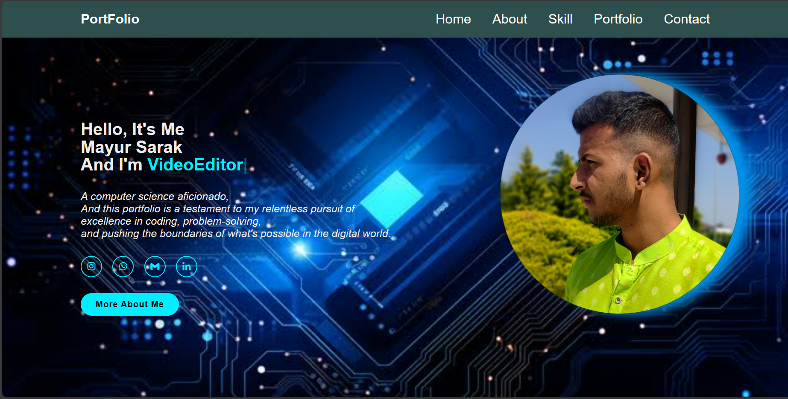

# Mayur Sarak - Portfolio Website

## Introduction

This project showcases my skills and projects. The website is created solely using HTML, CSS, and JavaScript. The portfolio website is designed to be responsive and visually stunning, providing visitors with a seamless experience across various devices.

## Table of Contents

- [Introduction](#introduction)
- [Features](#features)
- [Technologies Used](#technologies-used)
- [Installation](#installation)

## Features

This Portfolio Website includes the following sections:

1. **Home Section**: The landing page that gives an overview of work and skills.

2. **Education Section**: Displays details about educational background and professional experience.

3. **Skills Section**: Highlights the various technical skills.

4. **Contact Section**: Contact details.

## Technologies Used

The portfolio website is developed using the following technologies:

- HTML5
- CSS3
- JavaScript

## Installation

To run the portfolio website locally on your machine, follow these steps:

1. Clone the GitHub repository to your local machine:
   
2. Open the `index.html` file in your web browser.# CipherEn_Portfolio
